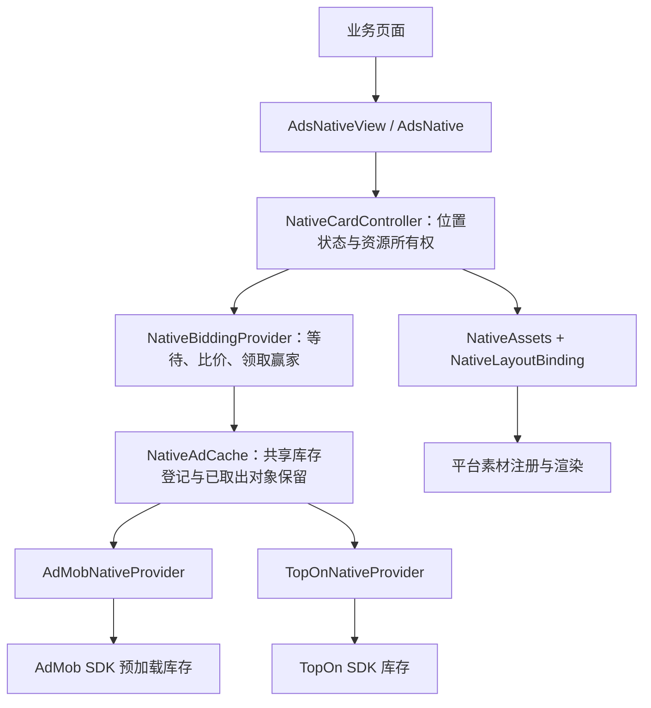

# 原生广告落地方案（待 Review）

日期：2026-09-30。状态：**方案草案，等待用户 review；本文不代表新方案已实现或已通过验证。**

目标工作树：`/Users/jiaoyun/.codex/worktrees/73e5/ads-mediation`。

本文更新早期方案中“不预加载、不跨平台比价、不跨 Activity 缓存”的限制。当前已实现的能力以 [接入文档](native-integration.md) 为准，历史测试事实以 [验证记录](../openspec/changes/add-page-native-ads/verification.md) 为准；二者不会因为本方案通过 review 就自动变为新方案的实现证据。方案确认后再同步 OpenSpec、实施代码和接入示例。

## 1. 推荐结论与交付范围

采用 **对业务统一封装、内部适配两个平台** 的方案：业务继续使用 `AdsNativeView` / `AdsNative`，库内部处理预加载、比价、取货、补货、有效性、资源释放及事件归因。TopOn 的内部操作语义与 AdMob 对齐，但不要求两个 SDK 具有相同的底层能力。

业务定义布局和样式，库提供统一只读素材 `NativeAssets`，并负责填充、媒体挂载和平台素材注册。保留现有 `NativeLayoutBinding`，不另造一套渲染协议。

本次交付包括：

- AdMob 与 TopOn 原生广告比价，优先保留 SDK 库存中的落选广告，供后续页面使用。
- 取货后补库存，跨 Activity 复用有效且从未渲染的广告；不搬运旧页面的 View。
- 已展示广告支持两种页面策略：暂离时销毁，或由原页面保留、返回时恢复同一实例；页面最终销毁时两种策略均释放资源。
- 默认布局、业务 View/XML 布局和现有 Compose 包装；模板与自渲染分别处理。
- 过期、并发取货、取消、迟到回调、素材不兼容、生命周期及收益归因。
- 中文注释、完整且人类易读的业务流程日志、针对风险的验证与可运行示例。
- 单 Activity 的 Compose 应用作为正式接入场景：以业务 `position_id` 唯一标识广告位置；库根据生命周期与显示信号管理资源，不识别页面实例或导航栈。

继续面向页面内独立卡片。长信息流复用、任意 Compose 素材插槽、SDK 升级、全屏广告缓存重构和新的远程配置系统不在本次范围内。

## 2. 现有基础与证据边界

| 项目 | 当前事实 | 本次需要完成 |
| --- | --- | --- |
| 公共入口 | 已有 `NativeRequest`、`AdsNativeView`、`AdsNative`、`NativeLayoutBinding` | 保持简单接入，增加统一素材入口 |
| 展示保留 | 当前隐藏会释放广告，Compose onRelease 直接销毁卡片 | 增加按位置保留策略；在收到最终销毁信号前，允许保留广告跨组合退出恢复 |
| AdMob 加载 | 生产路径仍为 `NativeAdLoader.load()` | 能力门槛通过后切换 `NativeAdPreloader` |
| 当前比价 | 先取得两端广告对象，再选择并缓存落选对象 | 优先先看库存和报价，只取出赢家 |
| 当前共享缓存 | 本层每平台/广告位最多一条、总计四条未渲染广告 | 缩为已取出对象的有界保留，不复制 SDK 库存 |
| 当前补货 | 生产原生缓存消费后尚未自动补货 | AdMob 使用 SDK 自动补货，TopOn 由库触发补货 |
| AdMob 预加载探针 | 1.2.1、Debug、API 36，三轮零价格测试广告的报价/取货身份与自动补货通过 | 非零报价、异常队列变化、R8、预加载对象跨 Activity 渲染仍须验证 |
| TopOn | 已有自渲染/模板处理、真实收益监听、缓存有效性检查 | 新库存路径、取货一致性、逐来源跨 Activity 展示仍须验证 |
| 视觉 | 已有部分来源展示证据；Pangle TestImage2 的媒体/图标空白仍有未解决记录 | 单独验证并关闭问题，不能以加载/曝光回调替代画面验收 |

保持当前依赖：GMA Next-Gen `1.2.1`、TopOn `6.6.22.3` 及现有适配器。在线文档的方法名、返回类型须在锁定版本确认。例如探针使用的取货结果是 `NativeAdLoadResult.NativeAdSuccess`，不能直接照抄新版文档类型。

Music 工程的借鉴是“业务创建布局并提供素材位置，广告库管理平台行为”。它的现有调用并不是让业务取得裸广告后自行点击、曝光和计费。本方案在这一方式上增加只读素材供业务选择外观。[M1]

## 3. 业务接入与素材契约

### 3.1 默认接入保持原样

```kotlin
val request = NativeRequest(
    position = "music_home_card_1",
    admobAdUnitId = admobNativeId,
    topOnPlacementId = topOnNativeId,
)

// 页面只提供广告位、布局和生命周期；库负责比价、取货与补货。
AdsNative(
    request = request,
    lifecycleOwner = pageOwner,
    active = isCurrentPage,
)
```

只提供一个平台 ID 时只使用该平台；两个 ID 才启用比价。现有单平台构造方式继续可用。初始化仍复用现有 `Ads.initialize` / UMP，不在本次另建 Native-only 初始化流程。

**业务 `position_id` 就是现有 `NativeRequest.position`，唯一代表一个广告场景或位置。** 例如两张卡片分别使用 `music_home_card_1`、`music_home_card_2`。库直接按这个值识别展示记录，不再生成 S12 这样的页面位编号，也不组合页面实例作为 key；该值不用于选择 XML，与平台的 adUnitId/placementId 分开。

同一 `position` 同时只允许一个展示容器占用。原容器的重复更新幂等处理，解除挂载后可按保留策略恢复；另一个容器同时占用则明确失败并记录位置冲突，不能抢走原广告或临时补一个编号。不同位置可以配置相同的平台广告位并共享未展示库存。

同一位置仍可先后获取多条广告，因此保留现有 `requestId`、`sessionId` 和请求代次，分别用于关联一次获取、一次展示及隔离迟到回调。它们不参与业务位置的命名；生命周期只提供显示、隐藏和最终销毁信号。

默认由库在首次合资格的页面请求时建立库存，并提前准备后续消费需要的广告。首个页面在冷启动时仍可能等待加载；本方案不承诺“从未登记过广告位也能提前加载”。首版不要求业务调用 start、poll、refill 或维护预加载句柄。

`Context` 仅用于 SDK 加载或创建带主题的 View，不能作为页面生命周期依据。Compose 入口默认读取当前组合提供的 `LocalLifecycleOwner`；它若是 Activity，并不能识别 Activity 内的页面切换。导航页面应使用具体页面 owner；保留在组合中的非当前页面通过现有 `active/visible` 表达状态。业务不需要自行持有广告对象或编写销毁回调，完整规则见第 8.1 节。

View 与 Compose 入口拟增加同一个 `retentionPolicy` 参数，明确支持以下两种展示方式；它不控制共享预加载库存：

```kotlin
enum class NativeRetentionPolicy {
    DESTROY_ON_HIDE,          // 暂离或隐藏时销毁，返回后重新获取广告。
    RETAIN_WHILE_PAGE_ALIVE,  // 原页面仍存在时保留，返回后恢复原广告。
}
```

Home → 设置 → 返回仍显示原广告的场景选择 `RETAIN_WHILE_PAGE_ALIVE`。原页面销毁、Activity 重建或广告不能继续使用时，仍需释放并在下次请求时获取可用广告。建议现有调用的默认值暂保留 `DESTROY_ON_HIDE` 以兼容当前行为，期望保留的页面显式选择第二种；默认值属于待 review 项，两种策略均为本次交付要求。

### 3.2 统一素材供业务决定外观

拟新增以下只读实体，字段均来自真实平台素材，缺失值保留 `null` / `UNKNOWN`：

```kotlin
/** 当前广告的只读素材快照；不能用它独立展示、点击或延长广告有效期。 */
data class NativeAssets(
    val headline: String?,
    val body: String?,
    val callToAction: String?,
    val advertiser: String?,
    val mediaType: NativeMediaType,
    val mediaAspectRatio: Float?,
    val adFrom: String?,
    val domain: String?,
    val warning: String?,
)

enum class NativeMediaType { IMAGE, VIDEO, UNKNOWN }
```

这些字段是拟议公共面，实施时只保留两端能准确映射、且业务确有使用价值的字段。无法判断创意类型时必须是 `UNKNOWN`，不能根据“没有视频时长”推断成图片。比例只能来自有效素材尺寸。

保留 `NativeLayout.Custom { context -> ... }`；新增明确命名的 `NativeLayout.Custom.withAssets { context, assets -> ... }` 工厂，避免破坏现有 lambda 调用。以下是**拟议接口示例，尚未实现**：

```kotlin
val musicLayout = remember {
    NativeLayout.Custom.withAssets { context, assets ->
        // 业务根据素材选择 XML 和样式，返回一份新的素材位置绑定。
        createMusicCardBinding(context, assets)
    }
}

AdsNative(
    request = request,
    layout = musicLayout,
    lifecycleOwner = pageOwner,
    active = isCurrentPage,
)
```

`createMusicCardBinding` 是宿主自己的布局函数，返回现有 `NativeLayoutBinding`。工厂每次创建独立 View 树；不能缓存 Activity、已挂载 root 或跨卡片共享 binding。模板广告不执行自渲染工厂。

| 内容 | 业务负责 | 广告库负责 |
| --- | --- | --- |
| 布局与样式 | XML、间距、颜色、字体、媒体位置；可读取素材选择布局 | 创建当前 Activity 对应的平台容器，校验绑定结构 |
| 文案 | 提供真实素材对应的 TextView 和样式 | 填入平台原文，处理可选项；不允许借此改写广告主内容 |
| 图片、图标、视频 | 提供空占位与合规尺寸 | 使用平台素材及媒体 View、处理必要回退和注册 |
| 来源、domain、warning、广告标识、AdChoices | 提供要求的可见位置 | 逐创意检查必需项并绑定披露元素 |
| 点击、曝光、收益 | 接收统一回调 | 由平台管理交互，转发真实回调并归因 |

不向 `NativeAssets` 放 `Activity`、`View`、裸 SDK 对象或可自行点击的链接。媒体不统一退化成图片 URL；需要由 SDK 管理的视频、图标、CTA 或披露 View 继续留在库内。单独保存素材快照不会取得广告的展示所有权。[G3][T1]

## 4. 内部结构：复用已有职责



| 现有位置 | 调整方向 |
| --- | --- |
| `NativeProvider` | 为两个真实平台定义内部预备库存、查看候选、独占领取、关闭本层管理的最小契约 |
| `AdMobNativeProvider` / `TopOnNativeProvider` | 平台 API、报价读取、身份校验、有效性、补货及平台渲染；平台差异在这里收口 |
| `NativeAdCache` / `NativeCandidateCache` | 管理共享库存实例及极少量已取出而未渲染的对象；复用现有容量、到期清理能力 |
| `NativeBiddingProvider` | 作为一次页面取广告的协调者；不再把协调流程伪装成第三种平台库存 |
| `BidCandidateSelector` | 继续承担纯选择逻辑；价格规则不复制到新类 |
| `NativeAdHandle` | 继续表达已领取广告的独占所有权、素材、绑定和幂等释放 |
| `NativeCardController` | 按 position 管理展示记录、请求代次、挂载与隐藏/恢复/销毁；接收生命周期信号，不维护页面实例身份 |
| `NativeAdEvents` / `AdsModuleLogger` | 统一归因和中文流程日志，复用既有开关和出口 |

内部方法可使用 `ensurePreloaded`、`peek`、`take`、`close` 表达职责，最终签名以锁定 SDK 的验证结果为准。只统一语义，不假装 TopOn 也有原生的 `bufferSize` 自动维护能力。

不新增通用广告引擎、Repository/Manager/Service 转发链、新的 DI 或状态机框架。素材实体放在 `NativeAssets.kt`；按 position 保留展示状态优先复用现有 controller/handle，只分离容器连接和广告所有权，不新增页面实例模型或另一套加载器。策略枚举放在公共 Native 类型附近；小型报价/缓存键类型放在职责相邻的已有文件中。

## 5. 加载、缓存、取货与补货

### 5.1 正常业务流程

1. 位置满足请求资格，生成本次 requestId；分别检查已选平台的初始化与 UMP 许可。
2. 按平台、广告位和影响请求结果的必要参数复用库存实例。同 key 只有一个本层加载/补货操作；页面只是订阅本轮结果。
3. 查询有效库存及非消费报价。两端都有候选即可决策；尚在准备的候选最多等待现有 `bidTimeoutMillis`，默认 7 秒。
4. 一端明确不能参与时不再等它。到期时有有效候选则继续，无候选则明确失败。比价结束不等待迟到平台再次改写赢家。
5. 主线程串行执行“重读候选 → 选择 → 取货 → 核对实际对象”；期间不插入业务回调或挂起点。SDK 自身仍可能改变库存，因此不能只靠主线程宣称原子安全。
6. 只取得获胜平台的广告，立即安装独立的事件与收益监听。落选平台广告留在原 SDK 库存，下一次重新确认有效性与报价。
7. 取货后启动下一条库存准备；补货成功不是本次显示的前提，不因补货失败撤下已显示广告。
8. 当前 Activity 创建布局；挂载前再检查代次、所有权、有效性、素材和尺寸。平台确认曝光后才记录曝光。

补货与页面渲染独立。页面销毁只取消该页面的等待和回调，不误销毁尚归库存所有的广告。

### 5.2 两个平台如何落地

| 操作 | AdMob | TopOn |
| --- | --- | --- |
| 首次预备 | 每个库存 key 启动一次 `NativeAdPreloader` | 单个受管理的 `TUNative` 调用 `makeAdRequest()` |
| 看库存 | 公共 availability / response peek | SDK readiness / `checkAdStatus()` |
| 看价格 | 复用现有价格模块与 JSON 配置，增加锁定版本 Native 队首路径 | 使用当前最高优先级广告信息，避免把缓存列表第一项当作下一条 |
| 取货 | `pollAd()`，处理空结果 | `getNativeAd()`，处理空结果 |
| 消费后补货 | SDK 自动补货；库不再叠加 load/start 循环 | 库在成功取货后请求下一条，并合并重复补货 |
| 落选 | 不 poll，保留 SDK 库存 | 不 get，保留 SDK 库存 |
| 失败重试 | 使用 SDK 自身重试，不再套一层周期任务 | 使用一个有界退避：首次失败后最多再试 3 次，建议间隔 2、4、8 秒 |

AdMob 首版目标库存建议为每 key **1 条**。此前 buffer=2 用于验证自动补货，并不代表生产必须缓存两条。TopOn 首版执行“一次消费触发一次补货”，不为了模拟数量 1/2 而反复请求；底层网络数量仍受 TopOn 配置与 SDK 控制。[G2][G4][T1]

AdMob 的预加载回调只发布状态变更，页面领取安排在回调退出后的主线程调度中；不在回调栈里再次 start 或 poll。[G4]

TopOn 的退避任务按库存 key 合并，前提是仍有预热需求、应用在前台且许可有效；关闭库存或许可撤回时取消。网络恢复/新页面显式重试可开启新一轮，不能让重复 `ensurePreloaded()` 绕过退避或重试上限。

### 5.3 缓存范围与跨 Activity

- 库存 key 包含平台、广告位及影响 SDK 请求/创意兼容性的参数；不包含 Activity、View、业务 `position`。模板需要请求宽度与确认的比例匹配。
- TopOn 可能按 placement 共享底层缓存。不同宽度的本层 key 不代表 SDK 完全隔离；同 placement 的请求参数修改和取货仍串行处理，取出后核对真实兼容性。此项进入设备门槛。
- 缓存期间不持有旧页面 callback、Activity 或 View；新页面使用自己的监听和主题 Context。Application Context 能加载不等于所有广告源都能跨 Activity 展示。
- 跨 Activity 复用仅承诺**同进程中有效且从未渲染的广告**；已经开始平台绑定/渲染的广告不回池，不二次出售。
- 已展示广告按原 position 保留，属于同一次展示的继续，不进入共享库存，不参与其他位置的比价，也不迁移到另一个 Activity。
- 本层保留区沿用每平台/兼容广告位一条、合计四条上限；保留原始期限，重复入池不能续期。发生取消、报价错位时，只有能证明有效且未渲染的对象才能进入该区。
- 保留区候选与 SDK 候选统一参加选择，但一个真实对象只出现一次；取出即转移所有权。SDK 不支持放回时保留区保存对象，不伪造回插 SDK 队列。

### 5.4 库存管理的停止条件

建议首版采用内部固定默认值：最后一个页面订阅结束后，前台保留 **5 分钟**预热窗口，支持连续 Activity 切换；无人订阅的受管理库存最多 **4 个 key**，超限关闭最久未使用项。活跃页面不被闲置淘汰规则驱逐。这些是本项目的资源策略，不是平台广告 TTL，先不增加公开配置项。

这里的订阅表示“当前页面对共享库存有有效需求”，不是 `AdsNativeView` 或 Activity 尚未销毁。离开组合、active=false、visible=false 或页面 owner 退出展示状态时，解除该页面的库存需求并取消当前等待；最后一个需求解除后才开始闲置窗口。返回栈页面即使保留自己的已展示广告，也不能因此让共享库存持续预热。返回且原广告可恢复时不再次取货；仅在需要下一条广告时重新订阅，不因重组/重复通知累加。

五分钟只适用于未消费库存的预热。页面当前广告按 retentionPolicy 处理：销毁模式隐藏即释放；保留模式由原页面继续持有，不受这五分钟闲置计时影响。单 Activity 内切页同样适用，与是否收到 Activity.onPause/onDestroy 无关。

退到后台停止本层补货和退避；AdMob 若没有可验证的保留库存暂停接口，使用该 key 的 `destroy` 停止自动预加载并清理其 SDK 库存，回到前台有需求再启动，因此不承诺后台往返始终命中旧库存。Activity 正常切换不应被现有生命周期监测误判为整个应用退到后台。

TopOn 关闭时解绑本层监听、取消本层任务并释放本层持有对象；没有公开清理能力的 SDK 共享库存不宣称已销毁，也不通过“取光缓存”模拟清理。SDK 内部在途请求不能由本层声称已取消。许可撤回后停止请求与使用原库存，恢复时按可验证的失效/更新机制处理，不能混入旧许可代次。

库存数量日志必须标明“SDK 可用库存”或“本层保留数”。四条/四 key 的限制不被描述成 TopOn 全部底层库存的硬上限。[G2]

## 6. 比价规则与取货一致性

继续使用当前 `BidCandidateSelector`：

| 情况 | 规则 |
| --- | --- |
| 两端价格可靠 | 以 USD/次展示比较，价高者胜出 |
| 相同价格 | 固定选 AdMob，与当前行为一致 |
| 一端价格未知 | 有可靠价格的一端优先；真实 0 是可靠价格 |
| 两端价格均未知 | 有广告时按既有固定优先级选择，并记录未完成价格比较 |
| 一端没有广告或不兼容 | 不参与；不能记作 0 元候选 |
| 非法金额或币种无法确认 | 标记价格未知；不猜测、不按当前汇率自行换算 |

TopOn 展示前使用 `getEcpm(TUAdConst.CURRENCY.USD) / 1000`；AdMob 使用 `valueMicros / 1_000_000`，两端统一为 USD/次展示。eCPM 精度用于说明报价来源（实时竞价、后台配置或历史估算），不作为参与比价的额外门槛。读取失败、负数或非有限值记为未知价格，真实 0 保留。`getPublisherRevenue()` 不参与展示前比价；实际收益只通过平台 paid 回调上报，不能用 eCPM 替代 ILRD。

每份内部报价同时保存平台广告身份/可验证令牌、金额及本次库存代次。`ResponseInfo` 是身份/响应信息，**公开 API 不提供用于这次比价的价格**；AdMob 价格反射集中在已有模块，校验版本、路径、金额和币种，失败记录一次原因后退化为未知价格，不使展示崩溃。

### 6.1 处理查询和取货之间的变化

- 报价只是候选快照，不代表库存预留。最终以实际取出的广告为准。
- 取空、对象身份变化、实际报价变化、已过期或不兼容时，旧报价失效。能读取真实对象报价时重新参与判断；不能可靠关联时不沿用旧价格。
- 最多允许 **一次重新选择**，整轮最多两次 SDK 取货；仍不能得到有效候选则明确失败，不循环清空队列。
- 重选时已取得但未渲染的有效对象进入本轮候选或有界保留区；不能在比较途中无条件销毁仍可复用的落选对象。
- 只对最终领取成功且身份有效的结果发一次 `ad_bid_result`。首次意向选择、重选过程留在流程日志中；事件中的价格不得对应旧对象。

TopOn 的 request/广告源等字段是否足以唯一关联报价和实际对象，必须用锁定版本验证；不能只凭两个字符串相同就宣布无竞态。若无法证明非消费报价可靠，采用现有“取出实际对象后比价并保留落选对象”的已知路径作为该能力的退路，不宣称实现了无消费比价。

### 6.2 渲染能力先筛选、取出后复核

已知的模板类型、请求尺寸、自渲染需求应在比价前排除不兼容项。`Custom` 只接受自渲染；模板需要后台确认的比例。

某些创意字段只有取出对象后可知，不能声称所有兼容性都能在 peek 时判断。此时取出后、正式确认赢家前检查一次，并按上述有界重选处理。业务 binding 在创建后仍需检查素材位置；binding 错误直接明确失败，不通过反复换广告掩盖宿主布局问题。

## 7. 广告过期处理

| 对象所在位置 | 判定及动作 |
| --- | --- |
| AdMob SDK 预加载库存 | 复用 SDK 的库存管理，每轮重新查询；首版同时限制本层预加载会话最长一小时，达到后销毁旧队列，有需求再启动 |
| 本层持有、尚未开始展示的普通 AdMob 加载对象 | 沿用原始加载记录的一小时缓存期限，采用单调时钟 |
| 从 AdMob 预加载器取出、尚未开始展示的对象 | 继承所属预加载会话的一小时保守期限；即使此时队列已补货，已取出对象也不更新期限。无法确认所属会话或已达期限则释放并按有界重选处理 |
| TopOn SDK 库存及已取出未展示对象 | 查询 SDK readiness，并在首次使用前检查对象 `isValid`；不套用统一 30 分钟/1 小时 SDK TTL |
| TopOn 共享保留区的未展示对象 | SDK 有效性与首次进入保留区的一小时本层上限同时满足；再入池不重置这个上限 |
| 已绑定且正在展示的广告 | 缓存到期不触发强制定时替换；页面释放或平台明确失效时按展示生命周期处理 |
| 已开始展示、由原页面暂时保留的广告 | 恢复同一展示前检查该广告源的已展示对象恢复条件；页面销毁、SDK 明确不再可用或平台要求的展示保留期限达到时释放，不机械套用未展示库存 TTL |

统一使用 `SystemClock.elapsedRealtime()`。`poll/get`、Activity 切换、重复回调和再次入池都不能把旧广告变成“刚加载”。Google 的一小时是缓存管理建议，TopOn 的本层上限是本项目策略，两者须在注释和日志中标明依据。[G1]

SDK 没有公开原始加载时间时，不伪造精确时间。AdMob 首版把 `start` 的单调时钟作为本层预加载会话的保守起点：库存会话达到一小时就关闭旧队列，有需求才重建；该会话已取出的未渲染对象沿用旧期限，不能跟着新队列续期。已绑定展示的对象不受队列轮换影响。

这个策略可能提前放弃会话后半段才补入的广告，是明确的首版取舍；它保证不会仅因补货/取货而重新计算一小时。逐广告时间只有在公开能力或可靠关联得到验证后才能取代这个保守界限。预加载完成回调可按身份记录观察时间用于诊断，但不能按回调顺序匹配 poll，也不能未经验证就据此延长保留。实现处用中文注释说明此限制和升级条件。

检查发生在缓存访问、比价、取货及首次绑定处；页级恢复另按已展示对象的语义检查。不能因为 TopOn 对象已经消费就把库存 readiness 或仅适用于首次展示的有效性字段直接当成恢复失败，具体接口含义在阶段 0 验证。已知本层缓存期限使用现有任务及时释放；失效导致库存不足且仍有预热需求时补货。SDK 未提供精确到期通知时按访问点重检，不虚构精确到期定时器。

本层记录“SDK 判无效”“本层保留到期”“无法确定可复用期限”三个不同原因。未知有效期不是已经过期，也不是可以永久缓存。

## 8. 渲染、生命周期与事件归因

- AdMob 继续用 `NativeAdView`，填充并注册素材，调用锁定版本的 `registerNativeAd`；监听先于注册和挂载。[G3]
- TopOn 优先使用 SDK 媒体、图标及要求的 CTA/披露 View；遵守先 `renderAdContainer`、再 `prepare` 的顺序。默认模板容器按实际宽度与已确认比例构造。[T1][T2]
- 页面最终挂载条件沿用：请求合法、平台可用、许可有效、owner RESUMED、active/visible、已附着、有效宽度、窗口焦点。加载资格与显示资格分开：已建立的共享库存可在前台预热窗口内继续补货，不因此挂载隐藏页面。
- 隐藏时按 retentionPolicy 销毁或由原页面保留；已渲染对象始终不回共享库存。平台/来源的暂停、恢复与重复附着能力需要验证，不能仅凭 Activity 还在就声称复用成功。
- 所有权及状态变更主线程串行；销毁先使代次失效，再取消订阅、移除本页 View、解绑回调、释放对象。清理、取消和销毁均幂等。
- 使用同一平台广告位的不同 position 不能同时取得同一对象；库存只剩一条时一方取得，另一方等待下一次补货或明确超时。同 position 的重复占用按第 3.1 节处理。
- 同一广告的加载来源身份保留，新的页面消费/展示会话单独归因；缓存搬运不伪造新的网络加载，不让旧页面 callback 收到新页面曝光。
- `ad_impression`、点击和 ILRD 均以平台回调为准。Loaded/挂载/可见不等于曝光；报价不等于收入；合法零收益保留。
- 合法迟到 paid 使用广告原身份交付，不能错挂当前页面；收益和业务回调异常各自隔离，不能破坏清理或另一条出口。
- Native 不占全屏展示锁；继续验证点击外跳、覆盖层关闭及返回与自动开屏的抑制逻辑。手动全屏机会沿用业务场景有效性。
- Compose 继续稳定持有 request/layout；普通重组不发请求，不重新创建广告。Fragment 使用 `viewLifecycleOwner`，导航使用具体页面 owner。

预加载回调未提供网络请求开始时刻时，不伪造精确网络耗时。保留现有事件的“本层请求”口径，并在日志明确它是页面获取、SDK 预热还是命中缓存。预热发生时尚无消费页面，不能把后来的页面 position 回填成原加载发生的场景。

### 8.1 销毁和保留两种展示策略

**页面暂时不可见不等于页面销毁。** 多 Activity 的 Home 打开设置后，Home 通常仍留在返回栈，返回时可恢复其原有界面；前提是实例没有被系统回收或重建。[A4] 本库允许已展示广告也归原页面继续持有，但仍须验证广告 SDK 的隐藏媒体、恢复和事件行为。

| 场景 | DESTROY_ON_HIDE：销毁模式 | RETAIN_WHILE_PAGE_ALIVE：保留模式 |
| --- | --- | --- |
| Home → 设置，Home 仍在返回栈 | 释放 Home 已展示广告 | 停止 Home 广告的展示/交互，安全暂停媒体，保留同一广告与平台容器 |
| 设置 → 返回 Home | 重新获取有效广告，优先使用共享库存 | 检查原展示可恢复后恢复同一条；不重新比价、取货或补货 |
| Tab 暂离、active=false、visible=false、短时失焦/detach | 释放当前广告，容器可保留 | 暂停当前展示，广告继续归原页面；不结束其广告会话 |
| 尚在等待首次加载/比价时离开 | 取消该页面本次获取 | 同样取消该页面本次获取；保留策略只保留已成功绑定的广告，不允许迟到结果挂回隐藏页面 |
| 页面 owner DESTROYED、宿主 Activity 销毁/重建、显式 destroy | 销毁广告和页面资源 | 同样销毁；不把 View 或广告转移到重建后的 Activity |
| 普通重组、最新回调更新 | 不重复加载或销毁 | 同左，不重新创建或注册原广告 |
| request/layout/retentionPolicy 确实改变 | 结束该广告位旧配置，重建 | 同左，不保留已不符合配置的原广告 |

在保留模式中，active/visible 只表示当前是否允许显示，不再隐含“销毁这条广告”。页面最终结束由明确的 owner 或销毁信号表达。Context 始终不变、Activity 一直 RESUMED 时也按这些页面信号执行，不靠 Activity 是否存活猜测页面状态。

保留对象只属于原 position。不能进共享库存、被其他位置使用或重新参与比价；两张卡片使用不同 position，即使它们配置相同的 placement，也各自独占对象。已经销毁的对象不能复活。

优先使用 SDK 已有且验证有效的生命周期行为；确有公开媒体控制接口时才调用。隐藏期间必须没有视频声音、无效交互或库自行制造的曝光；不能用“View 看不见了”代替验证。某个来源无法安全暂停/恢复时，释放对象并明确记录不支持保留及降级原因，该来源不能计为复用验收通过。

恢复是同一展示的继续：保持原加载身份和展示会话，不再次调用 render/prepare/registerNativeAd，不伪造新的 load、bid、impression 或 paid。平台真实回调仍按原身份和既有去重规则处理，不能因界面暂时分离而吞掉合法迟到收益。SDK 明确不再允许使用原对象时先释放，再按当前展示资格取得可用广告，记录具体原因；未展示缓存 TTL 不直接当成已展示对象的恢复期限。

### 8.2 单 Activity + Compose 中如何保留

**组合容器离开不必然表示这次展示需要结束。** 保留模式下，能持续接收该位置最终销毁信号时，不能继续使用无条件 `onRelease = destroy` 的旧规则。库只接收 owner 的生命周期事件，不查询导航栈或识别页面实例。[A1][A3]

- 销毁模式：onRelease 延续当前行为，销毁卡片及广告。
- 保留模式且有明确的最终销毁信号：onRelease 只解除旧组合容器的挂载与 UI 回调；按原 position 保留广告、原平台 NativeAdView 和事件身份。返回时创建新的外层 AdsNativeView，在同一 Activity 内重新附着原平台子 View，不把已退出的 AndroidView 外层实例直接复用。
- 展示记录仅以 position 索引，复用现有 controller/handle；不生成广告位 token，不需要 rememberSaveable 保存内部编号。owner 和 Activity 只用于生命周期监听及 View Context 安全检查，不作为索引的一部分。广告/View/Activity 不能进入 saveable 状态或跨配置 ViewModel，相同 position 也不能恢复进程已丢失的实例。
- owner 最终销毁时释放对应记录；原 Activity 销毁时释放其关联资源。记录与共享未展示库存分开，销毁时移除观察者和宿主引用，不让稳定 position 延长旧 Activity 的资源寿命。
- 展示记录不保存已退出组合的外层容器、宿主 lambda 或旧 UI 订阅；恢复时接上当前容器的回调。旧容器的延迟 onRelease 或旧观察者回调，只能清理它原先关联的记录；复用现有请求代次与记录引用判断，不能仅凭相同 position 删除新请求或新挂载。
- 若 Compose 的 owner 只有 Activity，组件持续保留时可以暂停/恢复；但组件移出组合后无法判断对应业务页面是否仍在返回栈，因此默认把这次卡片作用域视为结束并销毁。要跨组合退出保留，使用具体 pageEntry 或业务已经存在的页级 LifecycleOwner，不能伪称仅凭 Context 能识别页面。

Navigation Compose 的拟议接入方式如下，业务仍不持有 SDK 对象：[A3]

```kotlin
composable("music_home") { pageEntry ->
    AdsNative(
        request = homeNativeRequest,
        lifecycleOwner = pageEntry,
        retentionPolicy = NativeRetentionPolicy.RETAIN_WHILE_PAGE_ALIVE,
    )
}
```

保留在组合中的 Tab 可使用 `active = selectedTab == Tab.Home` 配合保留策略；切回来恢复该 Tab 原广告。仅设置 alpha=0 或遮挡不一定产生生命周期/可见性事件，业务仍需准确传 active/visible。

在销毁模式中，`if (showAd) { AdsNative(...) }` 移除组件即可销毁；在保留模式且页面 owner 尚存活时，这只表示暂时分离，原广告保留到页面结束。两个模式的这一差异必须写进接入文档，不能让业务误以为两者完全相同。

`onReset` 继续为 null，不扩展长信息流 View 复用。生命周期观察者配对安装/移除；组合清理只撤销本次宿主连接，不重复 destroy。普通重组不增加展示记录或观察者。[A1][A2]

### 8.3 隐藏、恢复与最终清理

复用现有主线程流程，明确三种动作，避免当前 release 逻辑把暂停也一律销毁：

1. **隐藏**：先使本轮待交付请求失效，取消等待与共享库存需求。销毁模式释放广告；保留模式停止展示和媒体，只解绑已退出组合的 UI 回调，保留广告身份与必要的平台事件监听。
2. **恢复**：按 position 找到原展示，重检显示资格、宿主 Context 兼容性、布局尺寸及该来源的恢复条件。原对象可继续使用则直接恢复，不获取第二条广告；否则记录原因并释放，再按资格获取。不能因一次重复 onResume 重复注册素材或展示会话。
3. **最终销毁**：标记终态、撤销所有交付、移除 View、关闭监听、释放 SDK 对象、删除该展示记录和观察者；重复 owner/onRelease/destroy 只清理一次。其他 position 不受影响，旧记录清理不能误删同 position 的新记录。

隐藏前尚未渲染的对象继续按第 5.3/7 节处理；已渲染对象在保留模式下只留在原页面。取消加载与终止广告事件交付要分开处理：旧加载结果不能挂回，当前保留广告的合法收益仍按原身份交付。清理与恢复不伪造卡片关闭或重新曝光。

当前代码仍是隐藏释放、onRelease 销毁，尚未实现按 position 保留。阶段 0/1/2 必须落实上述所有权变化；仅增加一个枚举而继续在旧 release 路径销毁，不能算完成保留模式。

## 9. 中文业务流程日志

### 9.1 输出原则

复用 `AdsModuleLogger`、`loggingEnabled` 和 `logTag`，不新建第二套 logger 或独立配置系统。原生路径现有散落的直接 `Log` 调用在本次改造范围内收口。

**采用简短、自然的中文，写清动作和结果。** 正常流程使用口语化短句；异常补充简短原因和处理动作，不使用需要另查含义的缩写编号。

普通日志采用以下格式，不打印内部请求、展示、库存或广告对象编号：

```text
[原生广告][业务位置] 简短说明动作和结果。
[原生广告][平台][平台广告位别名] 简短说明缓存处理情况。
```

- INFO 保留开始获取、比价结果、补货、渲染、曝光、收益和释放；落选保留、缓存查询明细、取货核对、补货调度等排查细节放 DEBUG。所有级别均用中文短句，完整流程可通过 DEBUG 查看。纯库存日志按平台和平台广告位定位，不归给尚未消费该库存的业务位置。
- `requestId`、`sessionId`、库存实例身份、广告对象身份及稳定英文 reason 仅作为 DEBUG 排查信息；用“获取记录”“展示记录”“平台响应标识”等完整字段名，并先给出简短排查结论。复用已有标识，不另建短编号映射。业务事件的原始身份和归因保持完整。
- DEBUG 信息能把获取、消费补货、展示和迟到收益关联起来；需要精确区分同位置的多轮获取时使用这些信息。普通日志不承诺独自完成对象级竞态排查。
- 日志“业务位置”打印 NativeRequest.position；本文业务称谓 position_id 不要求重命名现有 API 或埋点的 position 键。实施时检查既有 AdEvent.slotId 的兼容性，移除原生路径中多余的编号生成与传递，不改动其他广告格式的归因。
- 耗时写明阶段，如“缓存等待=120ms”“渲染=8ms”；不把缓存命中耗时记作网络加载耗时。
- 报价使用“0.002000 美元/次展示”，未知价格写“报价未知”。收益说明来自平台回调，不能称为资金已经到账；普通日志可准确换算为货币单位，DEBUG 保留原始金额、micros 与币种，转换仅用于显示。
- 日志关闭时不构造大字符串、不解析完整素材或堆栈；中文摘要使用短函数/延迟消息，避免热路径分配大型 Map/JSON。
- SDK 信息只打印必要字段，不输出 App Key、设备标识、素材下载地址、广告内容全文或完整 ResponseInfo JSON；平台广告位用可识别尾号/别名。
- 对外错误文本先去换行并限制长度。正常取消/无填充不打印异常堆栈，真实异常保留根因及一次堆栈。

### 9.2 必须覆盖的流程

| 阶段 | 日志必须解释的问题 |
| --- | --- |
| 资格与初始化 | 为什么本次可以请求，或在等什么；许可、平台、页面条件分别说明 |
| 预热与加载 | 谁触发、是否复用在途请求、哪一端在加载、成功/失败及重试安排 |
| 查询缓存 | SDK 库存还是本层保留对象；是否命中、失效原因、数量是否可知 |
| 候选比价 | 两端是否可参与、价格是否可靠、排除原因、最终选择规则 |
| 取货与重选 | 意向与实际对象是否一致、为什么重选、剩余次数、对象如何保留 |
| 落选保留 | 未消费而留在 SDK，还是已领取对象进入本层保留区 |
| 消费补货 | 哪一端库存被消费、SDK 自动补货还是库触发、是否合并重复请求 |
| 布局与挂载 | 自渲染/模板、内容尺寸、缺失素材、业务布局错误、为何不能挂载 |
| 曝光/点击/收益 | 平台确认了什么、真实收益金额与身份、是否重复或迟到 |
| 生命周期 | 当前展示策略、页面隐藏/恢复/销毁；原广告是否保留、恢复失败原因；共享库存与各位置已展示广告分别记录 |
| 结束 | 本轮成功/失败/取消、等待与渲染耗时、最终对象去向 |

INFO 输出获取开始和关键结果；DEBUG 补充流程细节和内部关联标识；WARN 输出异常原因及处理动作；ERROR 输出意外异常或契约错误。重复测量、同一等待条件和持续无库存不刷屏，只在状态/原因变化时打印。

### 9.3 示例日志（虚构数值，用于 review 格式）

普通日志：

```text
[原生广告][music_home_card_1] 开始获取广告，正在检查两端缓存。
[原生广告][music_home_card_1] 比价：AdMob 0.0012、TopOn 0.0020 美元/次展示，TopOn 胜出。
[原生广告][TopOn][广告位=首页原生] 已取走一条广告，正在预加载下一条。
[原生广告][music_home_card_1] 广告已完成渲染，等待平台确认曝光。
[原生广告][music_home_card_1] TopOn 已确认广告曝光。
```

异常与生命周期示例，各行代表独立情况：

```text
[原生广告][music_home_card_1] 重新比价 | 广告已变化，旧报价作废 | 剩余1次
[原生广告][music_home_card_1] 报价未知 | AdMob
[原生广告][TopOn][广告位=首页原生] 缓存失效 | 平台判定无效 | 排除候选，补货
[原生广告][TopOn][广告位=首页原生] 缓存释放 | 达到本地1小时保留上限
[原生广告][music_home_card_1] 取消后释放 | 广告有效期限未知
[原生广告][TopOn][广告位=首页原生] 加载无填充 | 2秒后重试 | 第1/3次
[原生广告][music_home_card_1] 取消等待 | 生命周期结束
[原生广告][music_home_card_1] 隐藏销毁 | 再次显示时重新获取
[原生广告][music_home_card_2] 隐藏保留 | 视频已暂停
[原生广告][music_home_card_2] 恢复显示 | 复用原广告
[原生广告][music_home_card_2] 保留降级 | 来源未通过恢复验证 | 已释放
[原生广告][music_home_card_2] 释放完成 | 生命周期结束
[原生广告][music_home_card_1] 渲染失败 | 布局缺少正文控件
```

DEBUG 记录完整过程，仍使用短句；“首页原生”为平台广告位别名，尖括号为现有内部标识的占位符：

```text
[原生广告][调试][music_home_card_1] 缓存命中 | AdMob、TopOn | 获取记录=<requestId>
[原生广告][调试][music_home_card_1] 取货核对 | 广告一致 | 获取记录=<requestId> | 平台响应标识=<responseId>
[原生广告][调试][music_home_card_1] 落选保留 | AdMob | SDK缓存 | 获取记录=<requestId>
[原生广告][调试][music_home_card_1] 展示关联 | 获取记录=<requestId> | 展示记录=<sessionId>
[原生广告][调试][TopOn][广告位=首页原生] 补货开始 | 触发获取记录=<requestId> | 预加载实例=<generation>
[原生广告][调试][TopOn][广告位=首页原生] 补货完成 | 下条可用 | 预加载实例=<generation>
[原生广告][调试][TopOn][广告位=首页原生] 忽略回调 | 旧预加载器已关闭 | 回调实例=<oldGeneration> | 当前实例=<currentGeneration>
```

日志验收：普通日志能直接读懂胜出、补货、展示、收益及释放结果；DEBUG 能追踪落选去向、调度细节、过期和对象关联。不得靠长句解释内部编号。未确认曝光不能写已曝光；未确认视频暂停不能写已暂停；图片广告不打印暂停视频；平台不提供库存数量时不猜测。

## 10. Kotlin 与代码整洁要求

以下作为实现与 review 的硬性检查项：

1. **复用优先**：先使用现有选择器、缓存、主线程调度、事件和 logger；不得在旁边新增同义实现。旧逻辑被替代后移除，不留两套默认路径和废弃状态。
2. **类型表达状态**：素材/报价/缓存键用不可变 `data class`；互斥结果在确有必要时用现有 sealed 类型或小型 `sealed interface`，避免一组相互矛盾的布尔值。SDK 对象作为有所有权的普通句柄，不使用可随意 `copy` 的 data class。
3. **空值真实**：价格未知、素材缺失、媒体类型未知分别表达；不使用 `!!`、哨兵金额或空字符串掩盖平台差异。
4. **主线程集中写入**：库存领取、所有权、页面状态和 View 操作在同一主线程入口处理；不同时铺设 `synchronized`、Atomic 和协程锁。只有 SDK 入口确需跨线程保证一次交付时保留局部同步。
5. **可读控制流**：优先早返回、清楚的局部变量及穷举 `when`；少用多层 `let/run/apply/also` 混合资源转移。简单循环不为了形式改成多次集合分配。
6. **生命周期明确**：不引入 `GlobalScope` 或每个广告一个后台线程；复用现有调度。若用协程，作用域归库存或页面明确所有，取消异常重新抛出。
7. **异常有范围**：只在平台 API、反射、业务工厂/回调和清理接缝处隔离异常；不整段 `runCatching` 后静默吞错。清理某一步失败仍执行余下步骤并记录根因。
8. **时间与金额可靠**：单调时钟计算期限；复用已有金额单位/校验，避免报价和 ILRD 混用，不为日志显示反向修改实际金额。
9. **注释用中文**：本次新增或实质修改代码的 KDoc、关键约束和原因注释使用中文；SDK 类名、协议字段、稳定 reason 保持原名。注释解释原因、所有权、单位和例外，不逐行翻译代码。
10. **清理随改动完成**：移除本次路径里的废弃字段、重复校验、无用 import、重复日志与过时注释；不顺带全仓库重命名/格式化。真实局限要用中文写清触发条件和后续验证，不用模糊 TODO。

建议的中文注释风格：

```kotlin
// 只有未渲染对象可以交给下一页面，已注册到平台容器的广告不再回池。
// 保留模式只延续原页面的展示；暂时隐藏不等于页面销毁。
// 取货时刻不代表加载时刻，跨页面保留必须沿用原期限。
// 先使请求代次失效，再释放资源，防止清理期间的 SDK 回调重新挂载旧广告。
```

保持可读性优先于字符数；不以单行嵌套表达式替代清楚的所有权步骤。默认不新增依赖、反射框架、图片下载器或日志序列化系统。

## 11. 实施顺序与阶段交付

| 阶段 | 工作内容 | 进入下一阶段的条件 |
| --- | --- | --- |
| 0：方案确认与最小能力验证 | review 本文；确认 TopOn 非消费报价/取货、尺寸干扰与监听重绑；扩展 AdMob 探针；验证两端已展示广告的隐藏媒体、同页恢复、平台容器重新附着和已展示有效性语义 | 区分“可行”“只能降级”“尚未验证”；每个声明支持保留的来源有真实恢复证据 |
| 1：库存和日志基础 | 实现共享实例、页面资格订阅、有界保留、期限与补货；分离共享库存与按位置保留的展示记录，接通双策略及中文日志 | 隐藏时解除库存需求；当前广告按策略销毁或保留，已展示对象不泄漏到共享库存 |
| 2：比价与页面闭环 | 完成取货核对、有界重选、并发和归因；接通多 Activity 返回及 Compose 按位置保留、隐藏/恢复/最终清理 | 销毁模式可重新获取，保留模式返回为同一对象且无重复取货/注册；两模式最终释放均可靠 |
| 3：素材与渲染接入 | 新增 NativeAssets 和 withAssets；保留旧 Custom；更新默认布局及两套真实业务 XML 示例，修复本次路径的明确渲染问题 | 业务不依赖平台类型，素材完整、平台注册正确、旧接入可编译 |
| 4：宿主与发布验收 | 接入用户提供的工程和 Native ID，验证跨 Activity、各来源素材、视频、收益、前后台与 R8；同步接入文档、OpenSpec 和验证记录 | 编译/JVM、设备、视觉及用户验收分别记录；未通过项有明确范围，不能以局部通过宣布全量可用 |

每阶段交付可 review 的小批改动与对应验证；中文注释和流程日志随功能完成，不留到最后补。除验证期间必须保留的旧路径外，不长期维护两个行为相同的完整加载引擎。

本轮仅修改本文。实施批准前不把现有 OpenSpec 任务改为已完成、不切换生产加载器、不运行真实广告请求、不提交或推送。

## 12. 验收矩阵

复用现有 JUnit、instrumentation、smoke 宿主和日志测试；每条风险由能失败的最小检查覆盖，不为 getter/DTO/机械转发逐项写测试。

| 层次 | 必须验证的行为 | 失败标准 |
| --- | --- | --- |
| JVM | 价格规则：高低、同价、真实零、未知、非法金额；等待超时和单端可用 | 错选、未知变零、无广告参与、终态重复 |
| JVM | 同 key 合并加载、补货去重、TopOn 退避上限、关闭取消 | 请求风暴、隐藏无限重试、关闭后本层任务复活 |
| JVM | 取货身份变化、实际价格变化、一次重选、单对象所有权 | 价格与对象不匹配、超过两次取货、对象同时给两个页面 |
| JVM | 原期限与首次保留期限、重复入池、系统改时、未知期限 | 取货/迁移导致续命、到期对象继续跨请求展示 |
| JVM | 缓存归属、代次失效、迟到成功/收益、业务回调异常 | 旧页面挂载、双重释放、收益错归或被日志/事件异常吞掉 |
| JVM | 页面反复失活/恢复；最后一份有效需求撤销后启动闲置计时，另一页仍使用时不误关闭库存 | 容器仍存在就永久保活库存、重组导致订阅累加、释放一页影响另一页 |
| JVM | 双策略：隐藏时 destroy 次数、保留对象身份、恢复后的 load/poll/render 次数、页面终结清理 | 保留模式仍被旧 release 销毁，恢复产生重复请求/注册，页面终结后仍持有广告 |
| JVM | position 唯一性、同容器幂等更新、不同容器重复占用、旧连接迟到清理 | 临时生成编号掩盖冲突、抢占原广告、旧回调删除同 position 的新记录 |
| JVM | 普通日志可独立读懂、DEBUG 关联、准确单位、关闭日志后惰性构造 | 普通日志堆叠长句或缩写编号、未知价格打印成零、DEBUG 无法关联消费与展示、日志开关无效 |
| 编译/接入 | 默认 View、Compose、旧 Custom、新 withAssets | 现有源码接入被意外破坏、平台类型泄漏到业务 |
| 设备 | AdMob peek 不消费、poll 与报价对应、消费自动补货；TopOn 同样的真实业务时序 | 只证明回调成功，无法证明库存与对象关系 |
| 设备 | A 页结束后，B 页取得同一未渲染广告并真实曝光；旧监听不触发 | 只验证同对象/isValid，没有真实渲染曝光 |
| 设备 | 不同 position 使用同一平台广告位、模板不同宽度、快速取消/旋转/切换 | 缓存串用、视图 parent 异常、错误尺寸或旧页面引用残留 |
| 设备 | 多 Activity Home → 设置 → 返回，两种策略分别运行；保留模式验证同一 SDK 对象、同一平台 View、隐藏静默及恢复展示 | 仅 Activity 尚存活就判通过；回到 Home 实际换了广告、重复绑定或后台仍播放 |
| Compose 接入 | Activity 持续 RESUMED：导航页面组合退出但 pageEntry 存活，随后返回/弹栈；保留 Tab 与 visible=false | 保留模式在 onRelease 中误毁广告，或页面真正弹栈后仍不释放；没有页面 owner 却无限保留 |
| Compose 接入 | 双卡片、动画、重复 owner/onRelease 通知、配置变化、Activity 重建及进程重启后的恢复 | 串用对象、重复销毁、旧 Activity View 被新 Activity 复用、声称恢复了进程已丢失的实例 |
| Compose 接入 | 销毁模式立即清理；保留模式分离旧 UI 回调但保留原事件身份，收到最终销毁信号后清空展示记录 | 已退出组合的宿主回调被展示记录持有、永久结束后资源残留、原广告迟到收益错归 |
| 设备/视觉 | 图片、视频、长文案、缺失素材、广告标识、AdChoices、CTA、深色和大字体 | 空白媒体/图标、素材缺项、遮挡、点击区扩大或隐藏视频继续播放 |
| Release/R8 | 新预加载反射路径、完整取货/补货/绑定/真实收益 | 仅 Debug 通过、仅编译通过、借用旧单条加载的 R8 结果 |
| 长时/时间控制 | JVM 用可控单调时钟跑到期；SDK 真实老化另做长时验证 | 把几十秒探针宣称为真实一小时/各网络 TTL 验证 |
| 全屏回归 | 既有全屏获取/反射不回退，Native 交互返回不误触开屏 | 公共价格或日志改动破坏原广告格式 |

真实 SDK 验证使用官方测试广告或已确认测试模式；不点击生产广告。跨来源验收按实际启用的网络列明，不能用某个 Pangle 结果代表所有 TopOn 来源。你已说明将提供真实工程和 Native ID，阶段 4 使用该工程验收，无需现在重新提供。

## 13. 本次建议 Review 的决策

以下列出待 review 的建议及已确认的业务约定；方案尚未作为实现批准：

1. 对业务保留统一卡片入口；内部统一取货语义。首版不新增需要业务管理的 preload/poll/refill 接口。
2. 素材使用只读 `NativeAssets`，业务决定外观；库完成填充、媒体及点击/曝光注册。保留旧 Custom，增加 withAssets。
3. 优先“非消费报价 → 只取赢家”；可靠性不成立的平台能力允许退回真实对象比价并有界保留，禁止错用价格。
4. AdMob 每 key 目标一条；TopOn 消费后补货，失败最多三次退避；无页面订阅时前台预热保留五分钟，闲置库存最多四 key。
5. 已取出未渲染对象继续采用有界保留，期限不重置；已渲染对象不跨页面回池。
6. 中文注释、中文可读流程日志、原始收益归因、过期和所有权测试纳入完成标准，与功能同批交付。普通日志使用简短、自然的中文；排查细节和内部编号放 DEBUG。
7. 必须支持销毁和保留两种展示策略；Home 需原样返回时选择 RETAIN_WHILE_PAGE_ALIVE。建议旧接入默认 DESTROY_ON_HIDE 以保持兼容，默认值可在 review 调整。
8. 单 Activity + Compose 为正式场景；保留模式按 position 持有已展示对象，允许跨组合退出恢复；生命周期只负责传递状态和最终销毁信号。业务提供策略和生命周期，不手动持有 SDK 对象。
9. 已确认：业务 position_id（现有 NativeRequest.position）唯一标识广告场景或位置；库不识别页面实例、不生成额外页面位编号。同一位置只允许一个容器占用，requestId/sessionId 继续区分多轮获取与展示。

## 参考与证据

官方网页在 2026-09-30 核对；在线文档不能代替当前锁定版本的编译、R8 和设备验证。本文的接口、容量、退避窗口及代码规范属于项目设计建议。

- [G1：Google Native 加载及缓存最佳实践](https://developers.google.com/admob/android/next-gen/native)
- [G2：NativeAdPreloader 公共方法、回调与库存行为](https://developers.google.com/admob/android/next-gen/reference/com/google/android/libraries/ads/mobile/sdk/nativead/NativeAdPreloader)
- [G3：Google Native 素材注册与展示](https://developers.google.com/admob/android/next-gen/native/advanced)
- [G4：官方 NativePreloadFragment 示例](https://github.com/googleads/gma-next-gen-sdk-android-examples/blob/main/kotlin/NextGenExample/app/src/main/java/com/example/nextgenexample/preloading/NativePreloadFragment.kt)
- [T1：TopOn 原生加载、预加载、渲染与释放](https://help.toponad.net/cn/docs/yuan-sheng-guang-gao)
- [T2：TopOn 官方自渲染 Demo](https://github.com/toponteam/TPN-Android-Demo/blob/main/app/src/main/java/com/test/ad/demo/SelfRenderViewUtil.java)
- [T3：TopOn Native 状态查询资料](https://help.toponad.net/docs/pzJJpp?preview=1)
- [R1：remax 参考工程固定版本](https://github.com/toukaRemax/remax_sdk/tree/83aecfbd9921b75073f761cf5797b7d076efed30)
- [A1：AndroidView 的创建、更新与 onRelease](https://developer.android.com/develop/ui/compose/migrate/interoperability-apis/views-in-compose)
- [A2：Compose 副作用与清理](https://developer.android.com/develop/ui/compose/side-effects)
- [A3：NavBackStackEntry 的页面生命周期](https://developer.android.com/guide/navigation/use-graph/programmatic)
- [A4：Activity 任务与返回栈](https://developer.android.com/guide/components/activities/tasks-and-back-stack)
- [M1：Music NativeHelper](/Users/jiaoyun/IGG/Music/app/src/main/java/com/music/player/ad/NativeHelper.kt)
- [本项目当前接入说明](native-integration.md)
- [本项目分层验证记录](../openspec/changes/add-page-native-ads/verification.md)

[G1]: https://developers.google.com/admob/android/next-gen/native
[G2]: https://developers.google.com/admob/android/next-gen/reference/com/google/android/libraries/ads/mobile/sdk/nativead/NativeAdPreloader
[G3]: https://developers.google.com/admob/android/next-gen/native/advanced
[G4]: https://github.com/googleads/gma-next-gen-sdk-android-examples/blob/main/kotlin/NextGenExample/app/src/main/java/com/example/nextgenexample/preloading/NativePreloadFragment.kt
[T1]: https://help.toponad.net/cn/docs/yuan-sheng-guang-gao
[T2]: https://github.com/toponteam/TPN-Android-Demo/blob/main/app/src/main/java/com/test/ad/demo/SelfRenderViewUtil.java
[M1]: /Users/jiaoyun/IGG/Music/app/src/main/java/com/music/player/ad/NativeHelper.kt
[A1]: https://developer.android.com/develop/ui/compose/migrate/interoperability-apis/views-in-compose
[A2]: https://developer.android.com/develop/ui/compose/side-effects
[A3]: https://developer.android.com/guide/navigation/use-graph/programmatic
[A4]: https://developer.android.com/guide/components/activities/tasks-and-back-stack
