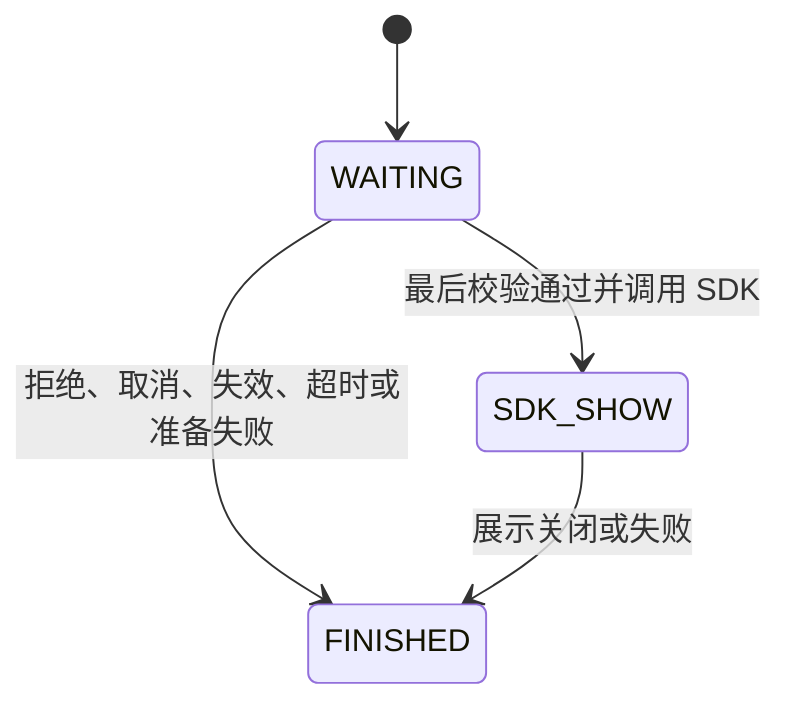

## Context

动机见 `proposal.md`，行为约束见 `specs/fullscreen-display-opportunities/spec.md`。本设计以当前实现为基础：

- `Ads` 统一路由开屏、插屏和激励展示，现有入口以立即尝试展示为主；竞价选择当前已缓存的同类型广告。
- AdMob 的 Preloader 已负责加载、补缓存及重试；TopOn 已通过各类型的 loading 标记和 `isAdReady` 防止重复加载。机会取消不需要停止这些机制。
- `AutoAppOpenController` 已使用主线程 Handler、经过时间和短周期检查；其自动触发、初始化后计时和当前 Activity 选择属于既有自动开屏行为。
- `AdLifecycleMonitor` 能看到 Activity 和应用前后台变化，不能看到同一 Activity 内的业务页面、导航条目或 Tab 变化。
- `FullScreenShowGate` 当前分别保存在两个 Provider 中，`isAnyAdShowing` 是状态汇总；`Ads` 还有独立的竞价占用标记。新增等待入口需要统一展示所有权，不能只增加一个互不关联的锁。
- 创建 `AdShowSession` 就会发送 `ad_position`。加载会话已有独立的 `request_id`，不能把轮询就绪或取消机会当成一次新的加载结果。

## Goals / Non-Goals

**Goals:**

- 让一次机会只有一个期限、一个原始宿主和一个最终结果；取消资格与保留加载分别由机会层、Provider 层负责。
- 多 Activity 与单 Activity 共用展示接口，通过不同的场景失效信号完成接入。
- 将所有全屏入口的占用检查和实际 SDK 展示交接接起来，使取消、超时和回调重入有明确顺序。

**Non-Goals:**

- 不建立新的网络加载系统、通用广告缓存框架或平台注册机制；后续广告类型与平台扩展范围见提案。
- 不把 Compose、Navigation 或宿主业务导航引入核心库，不新增协程版公共 API。
- 不替 SDK 保证交接后的物理撤回，不用加载等待期限推断广告已经关闭。

## Decisions

### 1. 新增三个等待入口和一个具体的取消句柄

沿用回调风格，新增 `showAppOpenWhenReady`、`showInterstitialWhenReady`、`showRewardedWhenReady`。以插屏的拟议签名为例：

```kotlin
fun showInterstitialWhenReady(
    activity: Activity,
    position: String = "manual",
    timeoutMillis: Long,
    isSceneValid: () -> Boolean = { true },
    onResult: (AdShowResult) -> Unit = {},
): AdDisplayOpportunity
```

`AdDisplayOpportunity` 是由库创建的具体句柄，仅公开幂等的 `cancel()`。开屏保留有、无宿主容器的接入方式；激励入口继续返回 `AdRewardResult`。等待时长由宿主明确传入，必须为正数。

`activity` 决定展示宿主，`position` 用于业务归因，句柄代表一次机会。相同 `position` 或相同页面名称不代表同一次机会，也不作为缓存隔离键。

`isSceneValid` 在主线程执行，必须读取当前场景状态，且应当快速、无副作用。默认值只适用于以 Activity 为完整场景边界的接入；单 Activity 内的页面必须提供检查并接入主动取消。检查异常以 `scene_validation_failed` 结束机会。

新入口和取消沿用现有入口的主线程调度习惯：主线程调用立即处理，其他线程调用转到主线程。取消以主线程中的状态变更为生效点，结果在主线程交付；创建时即记录起始时间，排队等待主线程的时间也计入期限。

选择新增入口而非改变旧入口，避免旧业务在缓存为空时突然进入等待。第一阶段不同时提供第二套 suspend/Flow 公共接口。

### 2. 用一个机会控制器读取已有缓存状态

增加一个内部全屏机会控制器，由 `Ads` 使用。它只保存当前机会的身份、广告类型、原始 Activity、可选容器、业务有效性检查、创建时间、等待时长和结果回调，不持有网络请求任务。

沿用现有 Handler 检查方式：创建后立即检查，等待期间最多每 100ms 检查一次，下一次间隔取 `min(100ms, 剩余时长)`。检查只读取初始化、许可、宿主和缓存状态，不调用旧 `show...` 入口探测就绪，也不反复创建展示会话。实际展示前仍有最后一次检查，因此计时消息延迟不会使过期机会获得展示资格。

加载处理保持在 Provider 内：

- AdMob 沿用已经启动的 Preloader；机会取消不调用其销毁或停止接口，新机会不重新启动已存在的预加载配置。
- TopOn 在一次机会对应的 Provider 初始化就绪后，至多主动执行一次该类型的 `ensureLoaded`。其现有 loading/ready 检查决定复用在途请求、缓存，还是启动必要加载；不在每个轮询周期或每次失败通知后重新调用加载。
- 单次加载失败不立即终止整个等待机会，也不由控制器增加重试循环；仍可等待平台已有重试或其他平台的广告，直至机会期限。后续新机会可以再次检查并触发必要加载。
- 兼容性按平台、广告类型、广告位及请求配置判断。当前固定配置可复用现有 Preloader ID 和 TopOn 广告实例，不新增独立缓存键注册表。

例如，A 超时只移除 A 的检查任务；L1 仍由 Provider 管理。B 创建后，TopOn 的 loading 标记或 AdMob 的预加载配置仍然存在，B 读取相同缓存状态即可继续等 L1，无需把 L1 的回调改绑给 B。

选择短周期检查而非新增一套跨 Provider 的加载订阅协议，复用已有做法并减少耦合。正常情况下可能增加最多一个检查间隔的响应延迟；主线程繁忙时延迟可能更长，但不能越过机会期限展示。

### 3. 机会状态与展示所有权分别记录

机会状态只需三个阶段：



期限使用 `SystemClock.elapsedRealtime()` 的经过时间差判断，避免系统日期变化以及直接累加期限导致的溢出。经过时间达到等待时长即失效，不依赖超时消息是否已执行。

`WAITING` 阶段的取消、失效与超时进入同一个结束路径：先标记终态、移除检查和生命周期监听、清理本次准备资源、释放本次占用和页面引用，再交付一次结果。迟到的检查任务以机会身份和状态判断后退出。用户回调即使抛出异常，也不能阻止清理或影响下一次机会。

进入 `SDK_SHOW` 后移除等待检查和页面有效性检查，释放只用于等待的引用；展示所需的回调交给 Provider。此后 `cancel()` 不改写结果、不释放仍在展示的占用、不吞掉奖励或收入回调。

不使用绑定页面的协程 Job 同时管理网络加载和机会，否则页面退出会把两种生命周期混在一起。

### 4. 同一时间接受一个全屏机会，拒绝隐式排队和替换

将现有 `FullScreenShowGate` 改为跨 Provider 共享的所有权检查：

- 新机会通过前置校验后取得唯一 owner，等待时也保留这一资格；另一个等待请求立即得到 `request_in_progress`。
- 已存在实际展示时，新调用得到 `another_full_screen_ad_showing`。
- 旧立即展示入口、直接 Provider 展示入口、竞价入口和旧自动开屏，在展示前经过同一占用检查；占用冲突立即失败，不隐式排队。
- 当前机会进入 Provider 展示时传递同一个内部 owner，不再次作为外部请求竞争，否则会拒绝自己的展示。
- 释放必须核对 owner；获取失败的路径、已结束机会的迟到回调均不能释放其他机会的占用。旧竞价标记合并进这一规则，避免两套占用状态不同步。
- `isAnyAdShowing` 仅表示已经进入 SDK 展示阶段；等待中的占用不能被生命周期监控误判为广告正在覆盖宿主。

业务如需替换等待中的机会，先取消旧机会，再明确创建新机会。第一阶段不设计队列、优先级或自动抢占；全屏广告本身需要互斥，拒绝冲突也能避免旧机会在后续页面突然排队展示。

### 5. 将最终检查放到 Provider 的实际展示边界

等待控制器发现候选后，只进入一次真正的展示尝试。竞价仍按当前同类型缓存快照选择；已有可用候选时不等另一平台加载完成，第一阶段不增加展示失败后的跨平台连跳。

Provider 的内部展示路径接收机会身份和展示前检查，而不直接从等待控制器调用现有公共展示入口后就认为已经交接。顺序为：

1. 确认候选及原始宿主，完成可能失败的准备工作；TopOn 开屏容器也绑定原 Activity，不能在宿主变化后重新找一个 Activity 接着展示。
2. 创建本次展示会话并发送所需事件；业务事件监听器可能重入取消或导航，因此发完事件仍需检查机会状态。
3. 尽可能延后 AdMob `pollAd()`，准备 SDK 展示回调，然后在紧贴 `show()` 的位置再次校验机会、期限、当前许可、场景、Activity、容器和 owner。
4. 校验通过才进入 `SDK_SHOW` 并立即调用 SDK，中间不安排新的主线程任务，也不主动调用业务代码。同步展示异常走正常展示失败路径。

SDK 回调的间接重入同样需要处理：AdMob 预加载通知先排入主线程消息，再向业务分发，不在 Preloader 回调栈内直接触发新的取广告/展示。Google 的文档要求避免在预加载回调内调用 `start()` 或 `pollAd()`，也建议直到准备展示时才取出广告。[AdMob 预加载与展示说明](https://developers.google.com/admob/android/next-gen/interstitial)

AdMob 取出广告到最终检查之间仍可能跨过期限。若最后校验失败，不能为了避免浪费而继续 `show()`：尚未展示的对象留在该 Provider 的单个待复用位置，解绑本次页面和展示回调，后续兼容机会优先检查它。该位置同时保留对应响应的原加载时间与可确认的价格信息；沿用平台有效期规则，不能以取消时间重新计龄，无法确认有效性的对象不作为可用广告，无法确认价格则按未知价格参与原有比较。`isReady`、价格读取和实际取用必须面对同一个候选。这里只处理交接中止后的对象保管，不建立第二套加载队列。

TopOn 在实际 `show()` 之前不消费已就绪广告；准备出的临时容器在机会中止时清理。广告最终已过期或 SDK 取出结果为空时，沿用展示准备失败结果，不重复建立会话重试。

选择最后检查和所有权传递，避免控制器检查通过后，在 Provider 的准备、事件回调或主线程排队中失去有效性仍继续展示。

### 6. Activity 自动兜底，页面切换由宿主提供信号

等待期间监听绑定 Activity，而非始终使用 `currentActivity` 作为新的展示宿主。采取保守策略：绑定 Activity 发生 `onPause` 时结束尚未交接的机会；另一个 Activity 恢复、原 Activity 销毁或结束、应用退后台也执行同样的幂等失效处理。新建机会若正等待原 Activity 首次恢复及窗口就绪，可以在原期限内继续检查。

这样 A 打开 B 时，不必等待 A 销毁，也不会在返回 A 后恢复旧机会。代价是临时覆盖造成的暂停同样会结束等待；恢复后需要新的业务触发。已经进入 `SDK_SHOW` 的机会不受此等待取消规则影响，避免把广告自身引起的宿主暂停当成取消成功。

| 接入形态 | 宿主传入内容 | 场景失效来源 |
| --- | --- | --- |
| 一个 Activity 对应完整业务页面 | 当前 Activity；有更细业务限制时传有效性检查 | 库的 Activity 监听兜底，主动导航前也可取消 |
| 单 Activity + Navigation | 宿主 Activity；当前页面条目的有效性检查 | 页面条目生命周期、导航状态和明确的离开事件 |
| 单 Activity + Fragment | 宿主 Activity；页面是否仍为当前交互场景 | 页面导航/可见性变化，View 销毁作为兜底 |
| 保留页面的 Tab 或自定义路由 | 宿主 Activity；选中页面及业务状态 | 选中项或场景资格变化时主动取消 |

单 Activity 不能用 Activity 生命周期代替页面生命周期，也不能只比较路由名称：同一路由可以有多个实例，A → B → A 不能恢复原机会。`isSceneValid` 是展示前检查，离开事件中的 `cancel()` 才是不可逆失效；所有离开路径，包括返回、手势和外部导航，都必须纳入宿主接入。

业务层的共同调用形态如下；`navigateToNextScene` 可以对应 `startActivity`、Navigation 跳转或 Tab 切换：

```kotlin
// 拟议接入示例：由一次业务事件调用，勿直接放在 Composable 函数体中。
opportunity = Ads.showInterstitialWhenReady(
    activity = hostActivity,
    position = "level_complete",
    timeoutMillis = 3_000,
    isSceneValid = { sceneStillValid() },
    onResult = ::handleAdResult,
)

// 在本次场景确定离开时执行。
opportunity?.cancel()
opportunity = null
navigateToNextScene()
```

Compose 的宿主示例采用 `remember` 保存当前句柄，使用 `rememberUpdatedState` 读取最新回调和检查值。通过稳定的 Activity、页面实例和业务触发身份控制创建，普通重组不创建新机会。`DisposableEffect` 负责监听的安装、移除和最终清理；仅有 `onDispose` 不足以覆盖页面被保留的导航或 Tab 场景，仍需在实际离开信号中取消。不要在每次 `ON_RESUME`、回调更新或 `isCurrentScene` 变回 true 时自动重发同一次业务触发。

Activity 配置变化造成重建时，旧机会结束；进程仍存活时 Provider 加载与缓存可继续供新机会使用。不要通过 ViewModel 或保存状态把持有旧 Activity 的机会句柄转交给新实例。进程被杀不承诺保留在途 SDK 请求。

Navigation 页面条目有独立生命周期，Compose Effect 的清理与重启由其 key 和 Composition 决定，这些机制只放在宿主接入示例中。[Navigation 页面条目](https://developer.android.com/guide/navigation/use-graph/programmatic#reference)、[Compose 副作用](https://developer.android.com/develop/ui/compose/side-effects#disposableeffect)

### 7. 保留旧自动开屏，新接入由宿主触发

用户已选择保留旧模式。旧 `autoShowAppOpen` 的配置默认值、自动触发责任和既有等待逻辑保持兼容，不在第一阶段给它增加页面绑定 API。

采用本次场景等待能力的宿主设置 `autoShowAppOpen = false`，由启动页或前台业务场景显式创建开屏机会，并负责页面级取消。单平台与竞价配置均按此接入，不能只关闭其中一个可能触发自动开屏的入口。

旧自动开屏依然经过共享的全屏占用检查。若业务同时保留自动开屏并调用新入口，只保证占用互斥；取消手动机会不等于取消另一个独立的自动开屏机会。页面严格绑定的接入说明必须明确关闭旧自动触发。

选择兼容旧模式并让新业务显式触发，避免库猜测单 Activity 中当前业务页面；将旧自动开屏整体迁入新控制器会同时改变触发时机、期限和事件口径，本阶段不做。

### 8. 机会结果通过回调，加载和展示事件保持各自含义

复用现有结果类型；在未创建展示会话前结束的激励机会返回 `rewardEarned = false`、失败结果及 `sessionId = null`。开始真实展示尝试后，返回该次展示会话的 ID，奖励继续以 SDK 的实际奖励回调为准。

| 结束情形 | 结果原因 |
| --- | --- |
| 等待期限结束 | `wait_timeout` |
| 宿主主动取消 | `opportunity_cancelled` |
| 场景检查返回 false / 检查异常 | `scene_invalid` / `scene_validation_failed` |
| 等待时长非正数 | `invalid_timeout` |
| 已有等待机会 / 已有 SDK 展示 | `request_in_progress` / `another_full_screen_ad_showing` |
| 宿主或请求前置条件不满足 | 沿用 `activity_not_available`、`activity_not_resumed`、`app_not_in_foreground`、`consent_not_obtained`、初始化失败等既有原因 |

多个结束信号相邻到达时，保留首个生效结果；例如暂停先于退后台被处理时，不为了改写原因再次回调。

新等待入口在真正选择候选并进入 Provider 展示尝试前，不调用 `events.begin`。因此纯等待超时或取消通过机会结果交付，不伪造 `ad_position`、`ad_bid_result` 或 `ad_show_fail`；业务若要统计等待漏斗，在机会创建处和结果回调处记录即可，本阶段不增加公共广告事件种类。

一旦进入真实展示尝试，沿用一次 `ad_position`、可选的 `ad_bid_result` 及原展示事件链。若事件监听器中重入取消、最终检查失败或准备失败，已经创建的会话以一次 `ad_show_fail` 结束，机会也只交付一次结果。不得在后续检查中再为同一机会创建另一份会话。

加载继续使用自身 `request_id` 和加载结果；取消机会不补发加载失败。旧立即展示入口和旧自动开屏保持原事件创建时点，收入事件与收入监听的既有分工不改变。宿主迁移后不能用新入口的 `ad_position` 数量代替全部机会创建次数。

### 9. 验证以状态、调用次数和生命周期为主

复用现有 JUnit 和可控时钟/调度方式验证控制器与所有权，避免为了测试引入通用 Provider 接口或新的测试框架。至少覆盖：

- A 超时、L1 继续、B 独立计时复用 L1；B 不产生重复加载，迟到的 A 任务不影响 B。
- 期限刚好到达、超时消息晚于就绪检查、取消与事件监听器重入；结束后 SDK `show()` 调用次数为零。
- 一个等待机会占用期间，新等待、旧立即展示及自动开屏的冲突；旧 owner 的释放不能影响新 owner。
- 原 Activity 暂停、A → B 且 A 未销毁、重建、同 Activity 的页面离开和快速返回；缓存仍由 Provider 保留。
- AdMob 已取出对象但最终检查失败时的保留、有效期及下一次选择一致性；TopOn 准备容器中止后的清理。
- SDK 交接后越过原等待期限、宿主暂停或取消，正常关闭/失败/奖励仍被处理且结果仅一次。
- 纯等待不创建展示事件，真实尝试最多创建一份会话；加载结果不因机会结束改写。

设备或宿主样例验收分别覆盖多 Activity、Navigation 页面和保留 Tab，确认重组不重新计时，离开后不展示，返回后新机会可复用加载。单元测试和编译通过不等同于真实广告 SDK 与导航行为验收。

## Risks / Trade-offs

- 100ms 检查会增加就绪响应延迟 → 只在唯一等待机会存在时运行；先验证实际体验，需要更低延迟时再增加内部就绪通知，不改变机会契约。
- 宿主未提供页面失效信号 → 库无法仅凭 Activity 发现单 Activity 内切页；接入文档给出页面、导航和保留 Tab 的独立验收用例。
- 暂时的 Activity 暂停也会结束等待 → 采用保守取消策略，后续业务可重新触发并复用加载；已经交接的广告不受等待取消影响。
- SDK 缓存状态可能在检查后变化 → 最后校验、准备失败处理和未交接广告的 Provider 内保管共同兜底，不能假设 `isReady` 是永久保留。
- AdMob 已取出广告不再由原队列完整管理 → 保留原加载元数据并校验有效期，未知价格使用既有未知报价规则；不扩展现有价格反射方案来猜测数据。
- SDK 交接后的内部延迟或回调异常无法由等待计时器撤回 → 保持展示阶段与等待阶段分离，既有 Provider 展示清理和回调超时不能冒充等待取消成功。
- 新旧入口并存时事件分母不同 → 接入说明明确机会统计与展示尝试统计，保留旧模式事件行为，避免上报重复。

## Migration Plan

1. 增加机会句柄、控制器及内部所有权/展示前检查，保留旧公共方法签名，运行上述核心状态与竞态验证。
2. 两家 Provider 接入共享占用和最终展示检查，验证单平台、竞价、旧立即展示及自动开屏路径。
3. 宿主迁移到新入口时关闭旧自动开屏，接入页面有效性检查和明确的离开取消；分别验证多 Activity 与单 Activity 页面。
4. 更新接入文档，明确机会结束原因、奖励处理、缓存复用以及新入口的事件统计时点。

宿主可退回旧立即展示入口和原自动开屏配置；需要恢复库的原行为时使用上一发布版本。不存在持久化数据迁移，新机会及在途加载不跨进程恢复。
